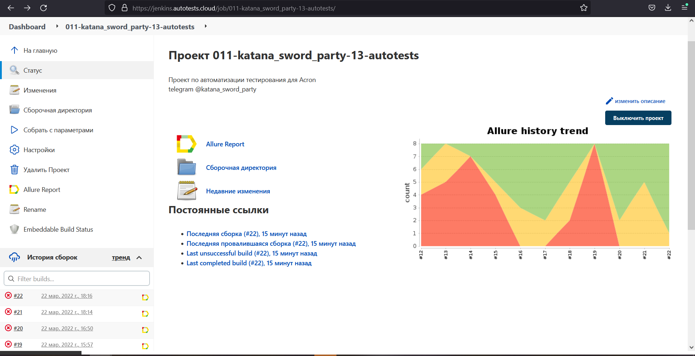
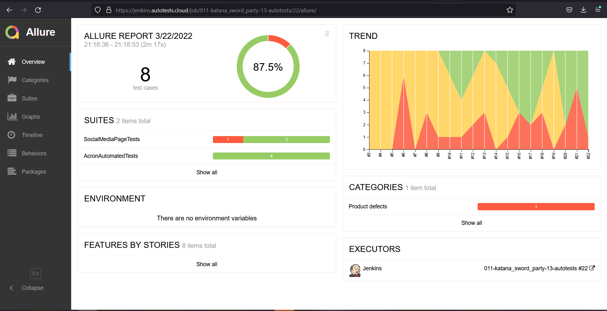
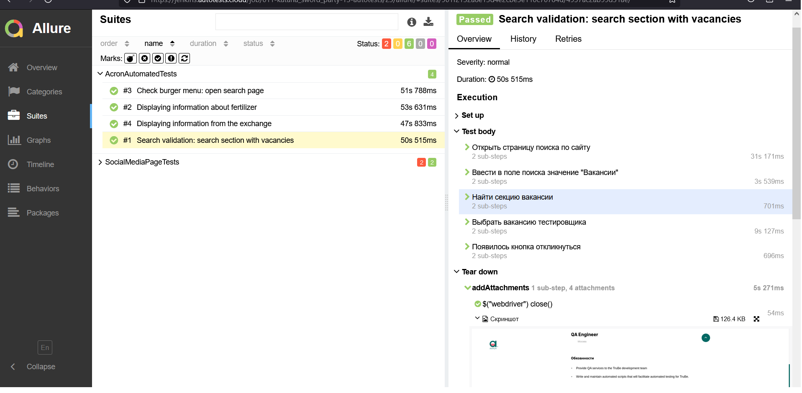
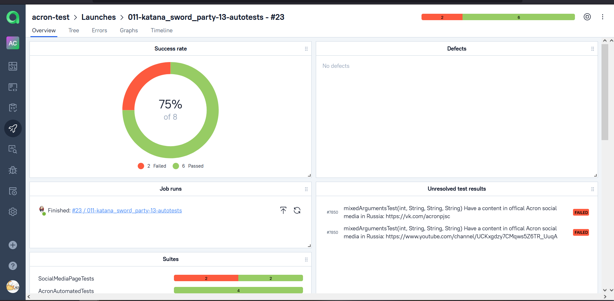
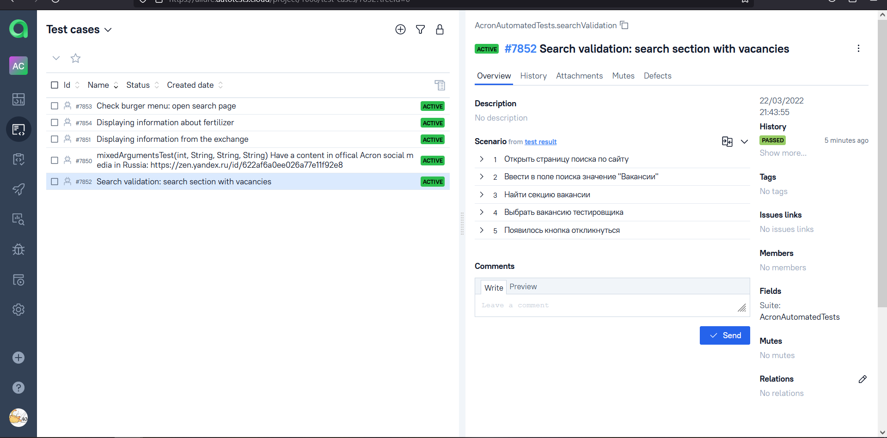
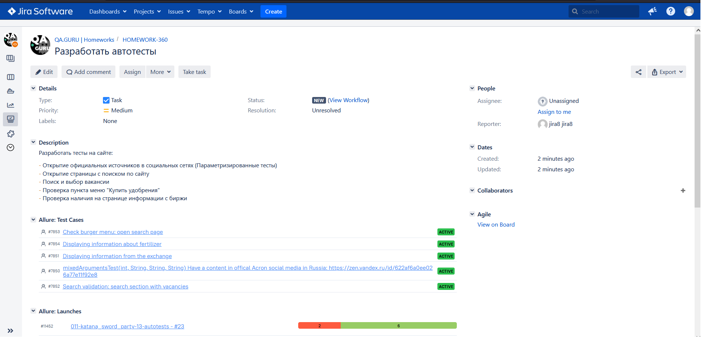
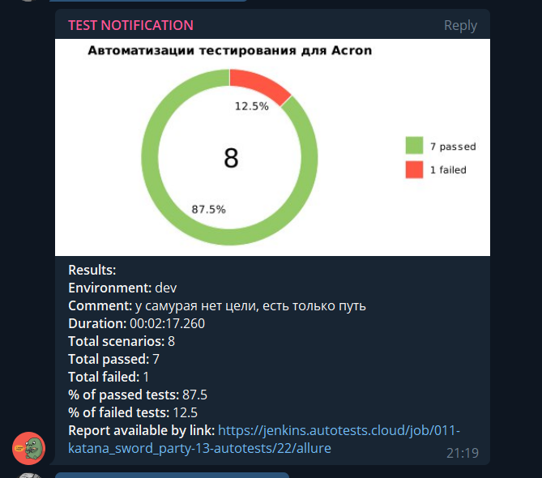
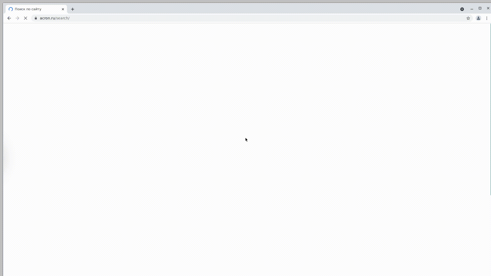

# Проект по автоматизации тестирования для Acron
## <a target="_blank" href="https://www.acron.ru/">Веб сайт Acron</a>

## :shinto_shrine: Содержание:

- <a href="#shinto_shrine-технологии-и-инструменты">Технологии и инструменты</a> 
- <a href="#shinto_shrine-реализованные-проверки">Реализованные проверки</a>
- <a href="#shinto_shrine-сборка-в-Jenkins">Сборка в Jenkins</a>
- <a href="#shinto_shrine-запуск-из-терминала">Запуск из терминала</a>
- <a href="#shinto_shrine-allure-отчет">Allure отчет</a>
- <a href="#shinto_shrine-интеграция-с-allure-testops">Интеграция с Allure TestOps</a>
- <a href="#shinto_shrine-интеграция-с-jira">Интеграция с Jira</a>
- <a href="#shinto_shrine-отчет-в-telegram">Отчет в Telegram</a>
- <a href="#shinto_shrine-видео-примеры-прохождения-тестов">Видео примеры прохождения тестов</a>

## :shinto_shrine: Технологии и инструменты
<p align="center">


</p>

## :shinto_shrine: Реализованные проверки
- Открытие официальных источников в социальных сетях (Параметризированные тесты)
- Открытие страницы с поиском по сайту
- Поиск и выбор вакансии
- Проверка пункта меню "Купить удобрения"
- Проверка наличия на странице информации с биржи

## :shinto_shrine: Сборка в Jenkins
### <a target="_blank" href="https://jenkins.autotests.cloud/job/011-katana_sword_party-13-autotests/">Сборка в Jenkins</a>
<p align="center">

</p>

### Параметры сборки в Jenkins:
Сборка в Jenkins

- browser (браузер, по умолчанию chrome)
- version (версия браузера, по умолчанию 91.0)
- size (размер окна браузера, по умолчанию 1920x1080)
- remoteUrl (адрес удаленного сервера selenoid)
- user (пользователль удаленного сервера selenoid, по умолчанию user1)
- password (пароль от удаленного сервера selenoid, по умолчанию 1234)
- threads (количество потоков)

## :shinto_shrine: Запуск из терминала
Локальный запуск:
```
gradle clean test
```

Удаленный запуск:
```
clean
test
-Duser=${USER}
-Dpassword=${PASSWORD}
-Dbrowser=${BROWSER}
-DremoteBrowser=${REMOTE_BROWSER}
-Dversion=${VERSION}
-Dsize=${BROWSER_SIZE}
-Dthreads=${THREADS}
```

## :shinto_shrine: Allure отчет
- ### Главный экран отчета
<p align="center">

</p>

- ### Страница с проведенными тестами
<p align="center">

</p>

## :shinto_shrine: Интеграция с Allure TestOps
- ### Экран с результатами запуска тестов
<p align="center">

</p>

- ### Страница с тестами в TestOps
<p align="center">

</p>

## :shinto_shrine: Интеграция с Jira
- ### Страница с задачей в Jira
<p align="center">

</p>

## :shinto_shrine: Отчет в Telegram
<p align="center">

</p>

## :shinto_shrine: Видео примеры прохождения тестов
> К каждому тесту в отчете прилагается видео. Одно из таких видео представлено ниже.
<p align="center">
  
</p>
